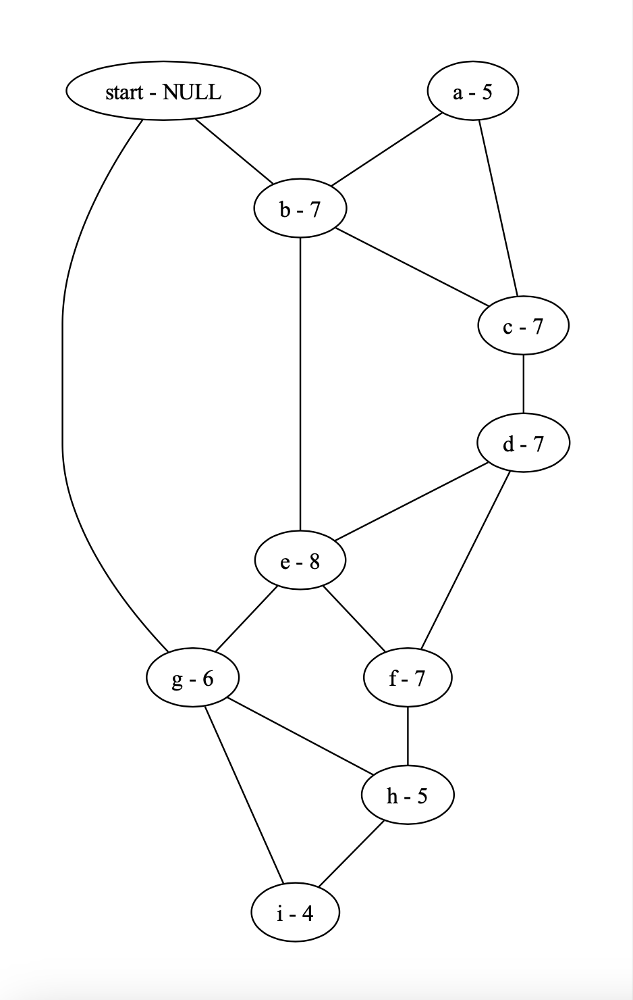

# Filament Constellation Wrap Solver
This program finds all solution candidates for the 3 Constellation Wrapping Puzzles on the Bridge segment of the video game *Filament*.

## Getting Set Up
- Build the program
```
make
```

## Options
- pass in a number 1-3 to capture a specific level's solutions: 

```
└─$./wrap_solver 1
Solution Sequence: 1 -> 0 -> 4 -> 3 -> 4 -> 5 -> 6 -> 9 -> 8 -> 7 -> 8 -> 7
Solution Sequence: 1 -> 0 -> 4 -> 3 -> 4 -> 5 -> 7 -> 8 -> 6 -> 9 -> 8 -> 7
Solution Sequence: 1 -> 0 -> 4 -> 3 -> 4 -> 5 -> 7 -> 8 -> 7 -> 8 -> 6 -> 9
...
```
The output shows each step that the user has to travel to in the sequence, starting from the START star (the star that the line originates from). Each star is assigned a number 0-9 (START star is 0), their identity can be discerned by viewing their graphs.

- pass in the `--print` flag to print a DOT graph: 

```
$./wrap_solver 2 --print | dot -Tpdf > level_2.pdf
```
This generates a level's graph, where stars are assigned a letter instead of a number (a = 1, b = 2, ...), as well as their wrap count, or the amount of times a user needs to wrap around the star in order to complete it. Pre-generated graphs can be found in the `assets/` directory, here is the level 2 graph: 


- Outputs (especially in level 3) can run large, with many of the solutions still invalid (for the video game). This can be further narrowed down with the `--validate` option: 

```
└─$./wrap_solver 3 | wc -l
   78969
 ┌───(tloja)@(tloja)-[~/Projects/WrapSolver]
└─$./wrap_solver 3 --validate | wc -l
    3856
```
This applies a few heuristics: e.g., the solution sequence can only end with a star facing the level's exit door, otherwise the user may have a solution where all the stars light up, but they can't leave the level since they will make contact with another star, thereby invalidating the whole constellation. 

## Solutions 
Solutions for each level can be found under `assets/solutions.txt`. Please use the graphs as a mapping guide to the actual level.

